<p align="center">
  
</p>

<h3 align="center">Give every coding agent the same second brain.<br>It remembers the codebase, proves its claims, and costs <i>zero tokens to read</i>.</h3>

<p align="center">
  <sub>Codex, Claude Code, Cursor, Windsurf, VS Code — one standard MCP server, one SQLite memory, identical tools.<br>No embeddings. No vector database. <b>Every checkable claim is mechanically tested against the real code.</b></sub>
</p>

<p align="center">
  
  
  
  
  
</p>

<p align="center">
  <a href="https://karang1908.github.io/irag/"><b>Docs</b></a> ·
  <a href="https://karang1908.github.io/irag/docs/quickstart/">Quickstart</a> ·
  <a href="https://karang1908.github.io/irag/docs/architecture/">How it works</a> ·
  <a href="https://karang1908.github.io/irag/docs/comparison/">vs. alternatives</a>
</p>

```bash
pip install git+https://github.com/Karang1908/irag.git \
  && irag init                            # that's the whole setup
# Then connect any MCP client to: irag mcp --root /absolute/project/path
```

<p align="center">
  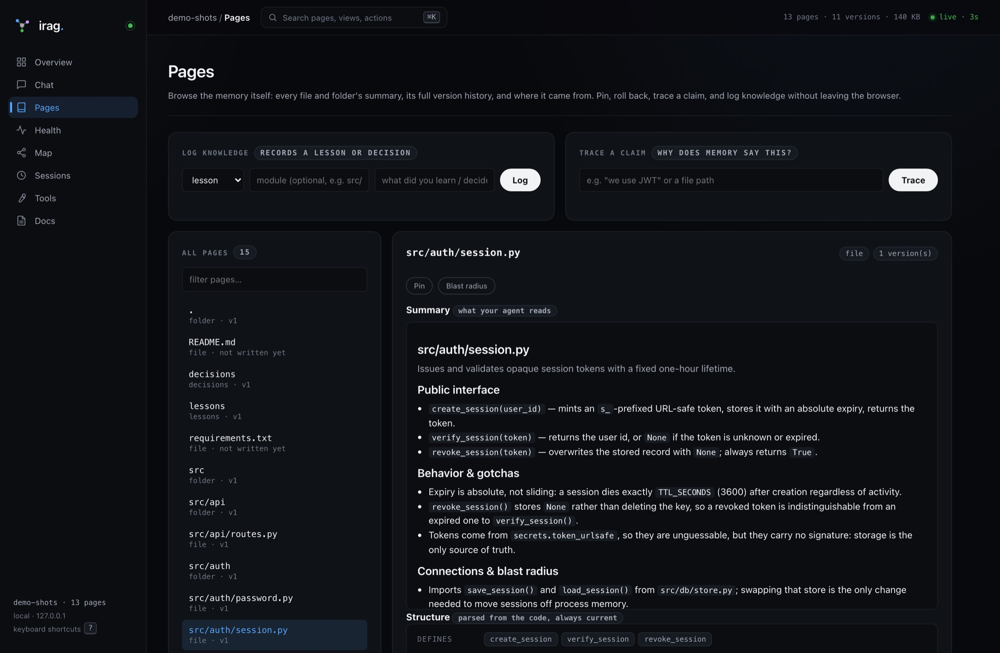
</p>

<p align="center">
  <sub><b>0 tokens</b> to search, map, or trace blast radius &nbsp;·&nbsp; <b>0</b> runtime dependencies &nbsp;·&nbsp; <b>0</b> cloud services<br>one SQLite file in your repo &nbsp;·&nbsp; writes run on whatever cheap model you point at it</sub>
</p>

---

## The problem

Your agent opens a fresh chat and knows nothing. So it greps. It opens
twelve files. It re-derives what it already worked out yesterday, and you
pay for every token of it — again tomorrow.

The usual fix is a markdown file the agent re-reads at startup. It goes
stale in a week, nobody notices, and the agent keeps confidently quoting
it.

**irag pays that cost once, writes it down, checks it against your code,
and gives the same verified memory to every agent you connect. It is the
missing state layer underneath coding agents.**

|  | without irag | with irag |
|---|---|---|
| Start a session | re-read the tree | **~650 tokens**, pre-ranked |
| "What does this file do?" | open and skim it | **0 tokens** — it's a row |
| "What breaks if I change it?" | trace imports by hand | **0 tokens**, 0.08s, transitive |
| "What did we decide last week?" | scroll back, or guess | **~87 tokens** |
| Memory is wrong | you find out the hard way | **CI fails** |

---

## Why it's different

**🔒 It can't quietly lie about what can be proved.**
Every checkable claim is tested against your actual code. Hallucinated paths, wrong
version pins and phantom symbols become queryable rows; contradicted pages
are never served without a warning; `irag check` fails CI while memory and
code disagree. The model writes prose; deterministic checks decide what can be trusted.

<p align="center">
  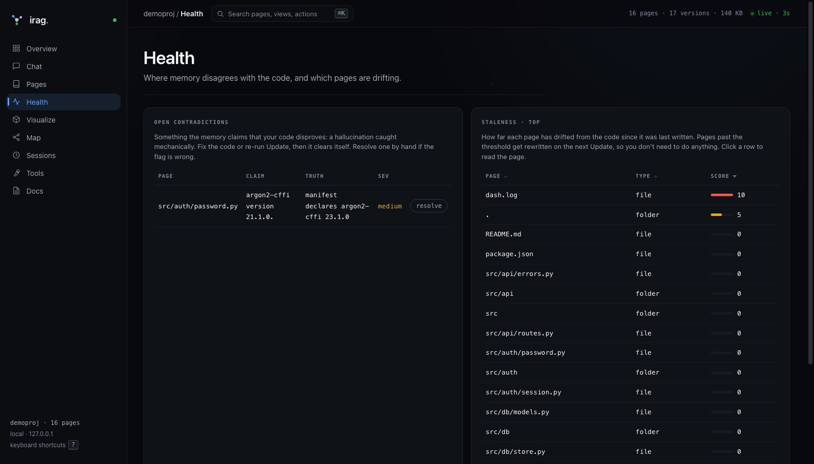
</p>

<p align="center">
  <sub>Real catches, from irag's own memory: a page claimed <code>irag/dashboard.py</code> references <code>_State.cfg</code>,<br>and that <code>irag/providers.py</code> defines <code>validator()</code>. Neither exists. Nobody read the pages to notice — a query did.</sub>
</p>

**⚡ Reads are free — structurally, not "cheaply".**
`search`, `map`, `impact`, `context`, `recap`, `why` are SQL and parsing.
Point irag at a model that bills per call, run all six, and its own meter
still reads `est. LLM tokens spent : 0` — because nothing on that path
can reach a model.

**🧭 It knows what breaks.**
`irag impact src/db/store.py` → every module that transitively depends on
it, parsed from the code, in under a tenth of a second.

**🕰 Git for your memory.**
Append-only revisions. `irag why "we use opaque tokens"` traces that
sentence to the commit that caused it. `irag asof 2026-06-01` time-travels.
Rollback never destroys history.

**📦 One file, zero dependencies.**
Stdlib Python. The whole memory is one SQLite file in your repo — no
service, no cloud, no keys. Move it, mount it from another machine, delete
it. It's a file.

**🔌 One protocol. Every serious coding agent.**
`irag mcp` is a standards-compliant stdio MCP server, not a Claude wrapper.
Codex, Claude Code, Cursor, Windsurf, VS Code and any compatible client receive
the same 22 context, search, map, impact, provenance, audit, application-proof, delivery, research,
team-memory, contradiction and diary tools backed by the same file. Switch
agents mid-project without resetting the project's brain.

**🧨 Contradictions become executable repair packets.**
Every contradiction has an **Agent brief** button. It opens a self-contained,
properly formatted HTML file with the false claim, observed truth, detector,
current memory page, verified structural context, and exact repair mission.
Open one issue or generate the master brief for all of them, then hand it to
any coding agent.

**🛡 It survives the boring failures that destroy trust.**
Ordered migrations back up before upgrading and refuse unsafe downgrades.
Dashboard updates have durable IDs and reconnectable live progress. Structural
scans reparse only changed files when safe, and renames preserve the complete
memory lineage. Provider failures retry and every call records model, latency,
token estimates, status, and optional user-priced cost.

**🔬 It audits the repository, not just the memory.**
One defensive pass scans code quality, secret patterns, unsafe execution,
dependency cycles, discovered API routes, and exact locked dependency versions
against OSV. Findings carry file, line, evidence, confidence, and remediation;
suspected secrets are redacted before they are stored or shown. A separate
loopback-only API checker safely probes parameter-free read routes without
following redirects. Review decisions persist across rescans and harmless line
shifts, accepted risks can expire automatically, and open findings export as
SARIF 2.1.0. Direct reports and probes fail closed when their structural
inventory is stale.

**🧪 It proves the app people are actually clicking.**
App Proof connects the layers static tools leave separated. It matches frontend
requests to backend routes, starts or attaches to a loopback app, crawls every
reachable page, validates links, inventories forms and controls, executes safe
APIs, collects optional Playwright evidence, runs the project's real test
commands, and can hammer read-only routes with bounded concurrency. The result
is not one reassuring green light: every behavior is labeled **proven, failed,
blocked, untested, or excluded**. A 404 cannot become “ready,” a visible button
cannot become “working” because it has an `onclick`, and a protected endpoint
cannot become “passed” without credentials. Each run becomes a durable HTML/
JSON repair packet any coding agent can execute.

**🧠 It has a thinking room with access to right now.**
The Thinking Studio combines project memory, the latest audit, the current diff,
and optional live web results for product, business, marketing, creative, and
code-review work. Every web result keeps its URL and retrieval time, current
claims require current sources, and repository evidence stays visibly separate
from outside evidence. The chat and recommendation board are durable project
memory, not another disposable conversation. Turn promising ideas into measured
experiments, and refresh source-backed watchlists to see what changed in the
market instead of repeatedly asking the same broad question.

**📚 The entire project fits on one living page.**
Main Summary renders the complete body of every current file, folder, decision,
and lesson page together with drift, contradictions, recent sessions, and audit
state. It refreshes structural truth automatically, tells you exactly which
narrative is stale, and never hides completeness behind a model-generated
abridgement.

**🚢 It closes the gap between understanding and shipping.**
Delivery reads the current diff, maps blast radius, flags public contract
removals, finds related tests, and produces a repository-native verification
plan and release brief. A reviewable JSON team-memory bundle carries decisions,
lessons, experiments, watchlists, topics, and security triage between worktrees
without copying source, transcripts, prompts, or executable facts.

---

## Quickstart

```bash
pip install git+https://github.com/Karang1908/irag.git
# or, from a source checkout:  pip install -e .
# (not on PyPI yet — `pip install irag` will not resolve)
cd your-project
irag init                   # works with or without git
irag doctor --probe-llm     # verify your summariser before spending anything
irag update                 # build the memory: one call per file and folder
irag mcp --root "$PWD"       # the universal agent interface
```

Register that final command in any MCP client. For Codex and Claude Code:

```bash
codex mcp add irag -- irag mcp --root /absolute/path/to/project
claude mcp add --scope project irag -- irag mcp --root /absolute/path/to/project
```

See [docs/MCP.md](docs/MCP.md) for generic JSON configurations and the full
tool contract. Claude Code users may additionally run `irag claude-setup` for
native hooks. With those hooks, **SessionStart** injects
ranked context plus a recap of previous sessions, **Stop** runs `irag
update` when your agent finishes a turn, **SessionEnd** writes the diary.
MCP exposes the same lifecycle explicitly to every client.

Then, day to day:

```bash
irag search "session expiry"     # instant, free
irag ask "how does login work?"  # AI answer, with citations
irag impact src/db/store.py      # blast radius, free
irag recap                       # "previously on this project"
irag dashboard                   # the whole thing, in a browser
irag proof --mode full           # prove the running full-stack app
```

### Point the writer at a cheap model

Reads are free; only writing summaries costs anything. Put that on a
different model from your coding agent:

```toml
# .irag/config.toml
[llm]
provider = "codex"        # claude | codex | agy | ollama | custom
model = ""                # provider default; required for ollama
retries = 1
```

The adapters normalize prompt delivery, retries, output, model provenance and
usage telemetry. Any CLI still works through `provider = "custom"`. The
fact-checker is model-agnostic, so a cheaper writer never weakens the trust
layer.

You can switch all of this from the dashboard Overview without editing TOML.
Claude, Codex, agy, Ollama, and custom-command choices are explicit; validation
and conflict detection prevent one browser tab from silently overwriting
another. Web research can use Brave, Tavily, a self-hosted SearXNG instance, or
the keyless DuckDuckGo fallback. Credentials stay in environment variables:
`BRAVE_SEARCH_API_KEY` or `TAVILY_API_KEY`.

---

## The dashboard

`irag dashboard` is the local, zero-dependency visual control plane over the
same memory as the CLI and MCP server. Status, updates, complete summaries,
audits, contradiction repair, sessions, configuration, maps, and sourced
thinking stay in one place.

<p align="center">
  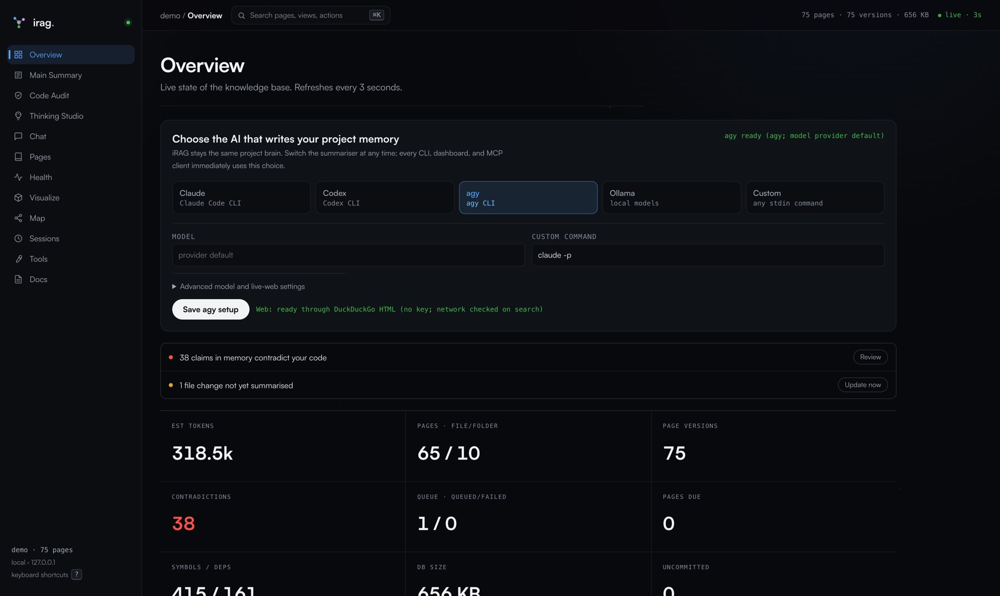
</p>

**`⌘K` searches everything** — pages, views, actions, and the *text inside*
your summaries. Instant, zero tokens.

<p align="center">
  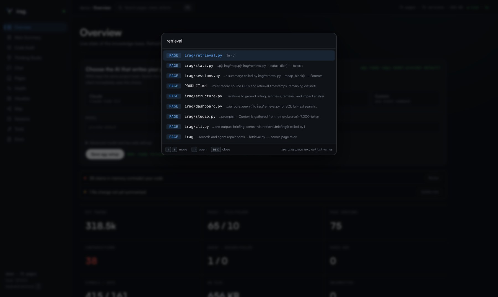
</p>

- **Pages** — one page is one object: summary, version history and diffs,
  the contradictions on it, and what it defines / imports / is imported by
  (clickable, so you walk the graph from where you are).
- **Overview** — what needs attention, each with the button that fixes it,
  plus live provider/model and web-research controls.
- **Main Summary** — the unabridged, continuously refreshed project story:
  every current page, decision, lesson, contradiction, session, audit state,
  and an explained Memory Trust score that shows exactly what needs attention.
- **Code Audit** — defensive security and quality findings, dependency advisory
  checks, API inventory, architecture cycles, and a loopback-only live API
  checker; triage findings with rationale/expiry and export open work as SARIF.
- **App Proof** — catch silent frontend/backend disconnects by tracing static
  contracts into live pages, links, routes, controls, browser behavior, project
  suites, and opt-in read-only stress; unknown behavior stays visibly unknown.
- **Thinking Studio** — a persistent code-review/product/business/marketing/
  creative chat with a recommendation board, measurable experiment ledger,
  and explicitly refreshed, source-preserving trend watchlists.
- **Health** — contradictions, staleness, one-click HTML handoffs for each
  issue, and one master agent repair brief.
- **Visualize** — your codebase in 3D: orbit it, zoom it, click a file to
  see what irag knows about it.
- **Map** — an Obsidian-style dependency graph: pan, zoom, trace imports.
- **Sessions** — every conversation with its per-file changes, and the
  verbatim transcript when capture is on.
- **Delivery** — inspect current changes, contract risk, blast radius, mapped
  tests, release gates, and a copyable agent brief; exchange reviewable team
  memory, preview agent context, time-travel, and run maintenance operations.
- **Chat** — routes lookups to instant SQL and questions to AI answers.
- **Docs** — the setup, architecture, MCP, and CLI manuals ship inside the
  dashboard, so the operating contract stays available with the tool.

**The audit is deterministic — no model on that path.** Every finding carries
its file, line, confidence and a concrete fix, suspected secret values are
redacted before they are printed or stored, and the only network call is the
optional OSV advisory lookup.

<p align="center">
  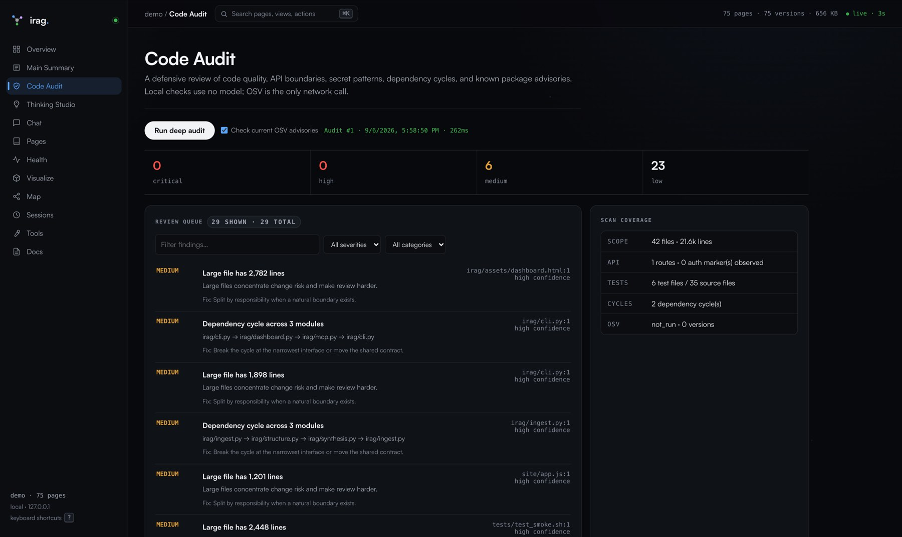
</p>

**Main Summary is the whole project on one page; the Studio turns it into
decisions.** Repository facts, model reasoning and dated web sources stay
visibly apart, and a recommendation cites the real file and line it came from.

<p align="center">
  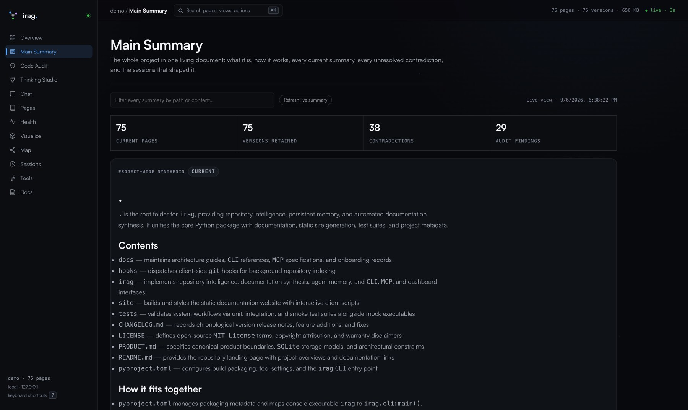
  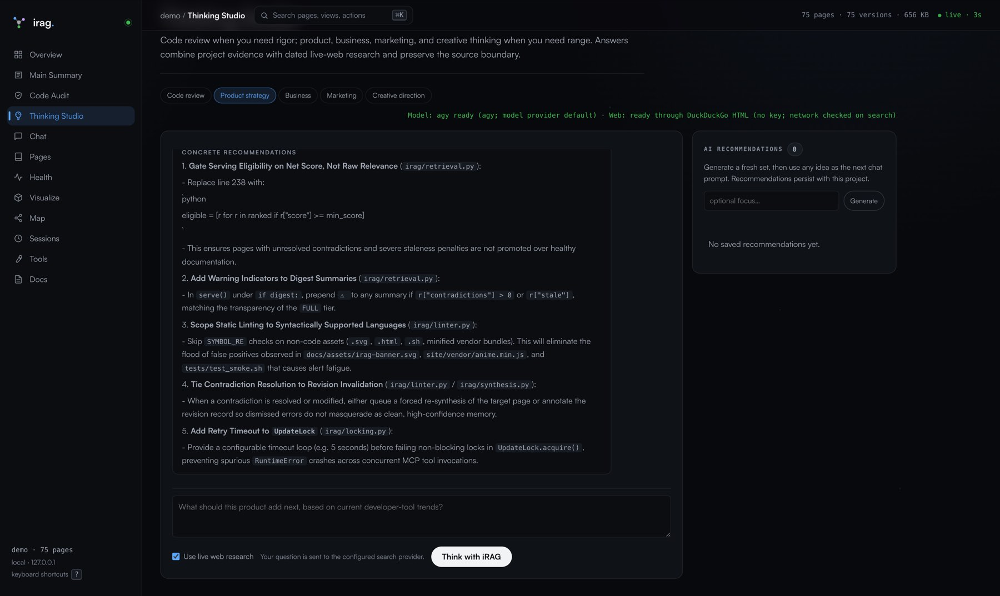
</p>

<p align="center">
  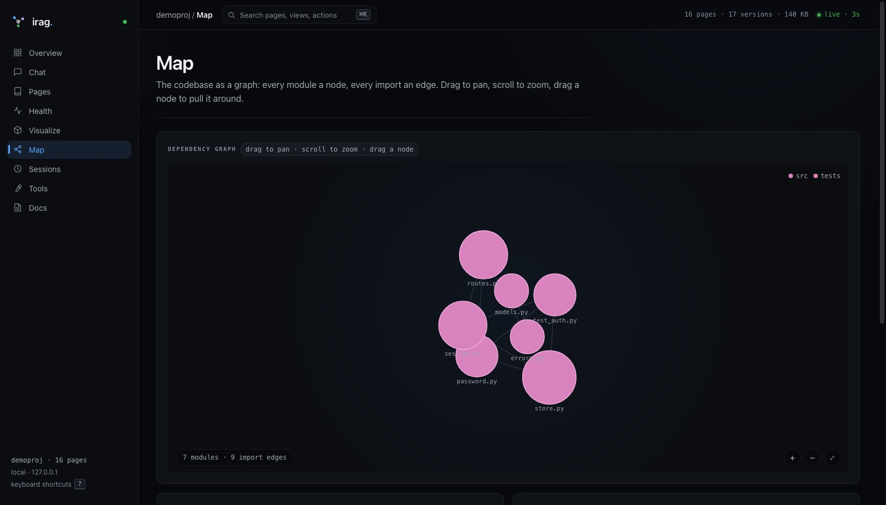
  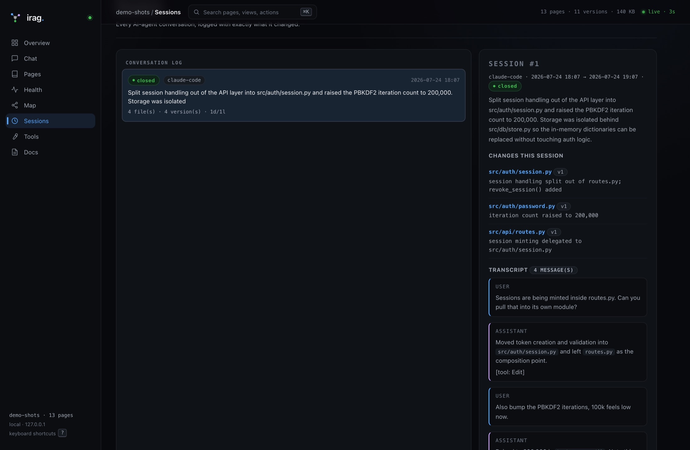
</p>

**Or see the whole thing in three dimensions.** Every node is a file, sized
by how many symbols it defines and coloured by top-level folder; every edge
is a real import. It's built from the same symbol and dependency tables the
CLI queries — your codebase, not a diagram of one — and it re-reads the map
every few seconds, so new files show up without a refresh.

<p align="center">
  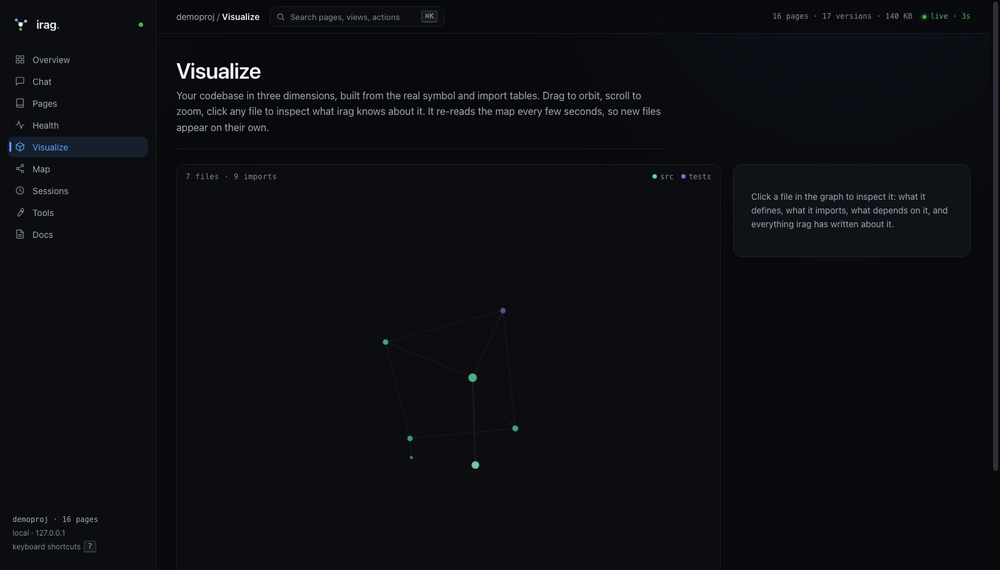
</p>

---

## Measured, not claimed

Run on irag's own source on a laptop, re-measured on the current tree:

| | |
|---|---|
| Full structural scan | **416 symbols, 161 import edges, 0.18s, 0 tokens** |
| `irag impact irag/db.py` | **23 dependent modules, 0.15s, 0 tokens** |
| `irag audit --offline` | **42 files, 21.6k lines, 0.26s, 0 tokens** |
| Resume a past conversation | **~87 tokens** |
| Brief a fresh session | **~650 tokens** effective, budget-capped |
| Runtime dependencies | **0** |
| Static analysis | **Ruff + mypy clean** |

The read path costs nothing because nothing on it calls a model. That's a
property of the architecture, not a benchmark you have to take on trust.

```bash
sh tests/test_smoke.sh    # the whole lifecycle, against a mock model — costs nothing
```

One command exercises init → ingest → synthesize → lint → contradiction
detection → CI gate → rollback → sessions → search/ask/recap/asof →
dashboard API → Obsidian export → directory-wise scoping → multi-language
graph → transcript capture. The mock model in the suite **deliberately
hallucinates a missing file**, so the fact-checker is proven to catch it
rather than assumed to. CI runs it on Python 3.11–3.14 on every push.

---

## Why a database, not a markdown file

Flat context files rot: stale claims nobody notices, links to files that
no longer exist, no way to ask *when* something became true or *why* the
file says it. Those aren't prose problems, they're **storage problems**.

| Memory | Question it answers | How irag does it |
|---|---|---|
| Structural | "how is the code shaped?" | AST/regex scan → `map`, `impact` — **zero tokens** |
| Semantic | "what is true here, and why?" | a versioned page per file & folder, **lint-verified** |
| Episodic | "what happened last session?" | every conversation logged with its exact per-file changes |

Two rules drive every design decision:

1. **The model never does bookkeeping.** Locating, counting, dating,
   diffing, scheduling, verifying — all SQL. The LLM only writes prose.
2. **Memory is data, read on demand.** `.irag/memory.db` is the only
   source of truth. `CLAUDE.md` is a static operator manual, not the
   memory.

## How it compares

Graphify tells you how the code is shaped. claude-mem tells you what
happened. **Neither can tell you whether what the agent believes is still
true.**

| | Graphify | claude-mem | irag |
|---|---|---|---|
| Kind of memory | structural | episodic | structural + semantic + episodic |
| Cost to read memory | free (graph query) | embedding call per query | **0 tokens — SQL, no model** |
| Can it be wrong? | rarely (a parse) | yes, silently, forever | yes — **and it detects, records and gates CI on it** |
| Verified against your code | n/a — no claims to verify | ❌ | ✅ **linter → contradictions → CI gate** |
| Storage | — | vector DB | **one SQLite file, zero deps** |
| History (`why` / `asof` / rollback) | ❌ | ❌ | ✅ |
| Cost scales with | commits (free) | conversation volume | repo churn, on whatever model you choose |

Honest full comparison, including where the others win:
[docs/COMPARISON.md](docs/COMPARISON.md).

## Where this came from

It started as a Database Systems assignment. Karpathy's LLM Wiki had just
landed and the failure mode was obvious: it was all just files — nothing
versioned, nothing checked, nothing stopping it going quietly stale while
people kept trusting it.

I picked a law firm as the domain, which turned out to be the right kind
of hard: a wrong court date is a real failure, not a bad chatbot answer.
That pressure produced the actual idea — **a database system with an AI
layer, not an AI system with a database attached**. Five tables did the
real work; the AI only ever wrote prose. I tested it by imagining the AI
ripped out entirely, and a working system was still standing.

Those five tables were never about law firms. They were an answer to
*how do you let an AI write something you can actually trust?* — so I
pointed them at coding agents, the things that forget everything the
moment you close the terminal.

The full version: [docs/STORY.md](docs/STORY.md).

## Commands (51)

`init` · `claude-setup` · `doctor` — setup ·
`sync` · `ingest-commit` · `scan` — detect ·
`synthesize` · `update` · `lint` · `learn` · `record-decision` · `resolve` ·
`rollback` · `forget` — write ·
`search` · `map` · `impact` · `stale` · `status` · `diff` ·
`contradictions` · `contradiction-report` · `asof` · `brief` · `suggest` · `facts` ·
`candidates` — read (SQL, zero tokens) ·
`ask` · `context` — read (AI) ·
`tried` · `verify` · `topic` · `capture` — record what only you know ·
`session-begin` · `session-end` · `sessions` · `transcript` · `recap` — diary ·
`pin` · `unpin` · `export` · `check` · `backup` — admin ·
`dashboard` · `obsidian` · `why` · `mcp` · `provider` · `audit` · `proof` · `web-search` —
views, protocol, defensive analysis, live evidence & provenance

Four of these record what a summariser cannot infer:

```bash
irag learn  "argon2 rehash happens in place on verify" --module auth.py
irag tried  "position:sticky" --because "only catches after you scroll past"
irag topic  "root privilege" --files scanner.py,net.py,ui.html
irag verify "scan aborts without root" --cmd "python3 -m scanner --probe" \
            --expect QUITTING --module scanner.py
```

`tried` stores a **dead end**, so the next session doesn't re-derive it.
`topic` gives a page to a concept that spans files sharing no folder.
`verify` is **executable memory** — a claim that carries the command
proving it, which `irag check` can re-run. And `irag brief <file>` prints
everything known about one file; after `claude-setup` it fires
automatically just before your agent edits it.

Full reference: [docs/CLI_REFERENCE.md](docs/CLI_REFERENCE.md).

## Documentation

**📖 [karang1908.github.io/irag](https://karang1908.github.io/irag/)** —
searchable, with a quickstart, architecture deep-dive and full CLI
reference. Built by `site/build.py` (stdlib, zero deps). The same content
lives here:

- [SETUP.md](docs/SETUP.md) — install, LLM configuration, hooks, CI gate
- [MCP.md](docs/MCP.md) — connect Codex, Claude, Cursor, Windsurf, VS Code, or any MCP client
- [ARCHITECTURE.md](docs/ARCHITECTURE.md) — schema, data flows, retrieval scoring
- [CLI_REFERENCE.md](docs/CLI_REFERENCE.md) — every command and flag
- [COMPARISON.md](docs/COMPARISON.md) — vs Graphify & claude-mem
- [DEVELOPMENT.md](docs/DEVELOPMENT.md) — contributing
- [HANDOFF.md](docs/HANDOFF.md) — for an agent developing irag itself
- [CHANGELOG.md](CHANGELOG.md)

## Roadmap

- Confidence scoring driven by lint and executable-fact history
- CI annotations that attach contradiction repair packets to pull requests
- Real-model regression evals for critical-context retention
- Optional authenticated Streamable HTTP transport for shared remote teams

## License

[MIT](LICENSE) · built by [Karan Garg](https://github.com/Karang1908)
